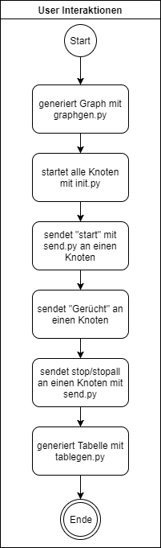

# HTW Saar AVA Übung 1

## Erzeugen eines Graphen:
    python3 graphgen.py [-h] n m savepath
    
    positional arguments:
        n           Anzahl der Knoten
        m           Anzahl der Kanten. Falls m > (n*(n-1))/2 wird die maximale Anzahl an Kanten gesetzt.
        savepath    Speicherort der Graphviz-Datei
        

## Starten der Knoten:
    python3 init.py [-h] [--c C] nodepath graphpath
    
    positional arguments:
        nodepath    Pfad zur Endpoint-Datei
        graphpath   Pfad zur Graphviz-Datei
        
    optional arguments:
        -h, --help  Zeigt die Hilfe
        --c C       Glaubensgrenze als Ganzzahl. Standard ist 1
 
## Senden von Kontrollnachrichten:
    python3 send.py endpoints nid msg
    
    positional arguments:
        endpoints   Pfad zur Endpoint-Datei
        nid         ID des Empfänger-Knoten
        msg         Die Nachricht die gesendet werden soll
        
## Erläuterung der Idee
### Aufgabe 1
Es soll ein lokaler Knoten als Prozess implementiert werden, der anhand einer Datei mit Endpunkten (ID, IP-Adresse, Port) einen Listen-Port öffnet und auf empfangene Nachrichten reagiert bzw. auch aktiv Nachrichten an seine Nachbarn versenden kann. Nachbarn sind hierbei drei zufällig aus der Endpunkt-Datei gewählte Knoten. Der Benutzer soll einen Knoten aus der Datei mit Endpunkten auswählen können und an diesen eine Nachricht schicken können. Hat diese Nachricht den Inhalt "start" wird der Empfängerknoten als Initiator ausgewählt. Dieser beginnt nach Erhalt der Nachricht seine ID an all seine Nachbarn zu senden. Sobald ein anderer Knoten eine Nachricht erhalten hat, sendet er ebenfalls an all seine Nachbarn seine ID, falls er dies noch nicht getan hat. Jede empfangene oder gesendete Nachricht wird mit Zeitstempel ausgegeben. 

Empfängt ein Knoten eine Nachricht mit dem Inhalt "stop", terminiert er. Empfängt er "stopall", leitet er die Nachricht an alle Nachbarknoten weiter und terminiert dann.

### Aufgabe 2
Der Knoten soll sich anhand einer übergebenen Graphviz-Datei seine Nachbarn entsprechend des Graphen wählen.

### Aufgabe 3
Das Programm _graphgen.py_ soll mit Hilfe von Kommandozeilen-Parametern einen zusammenhängenden, ungerichteten Graphen erzeugen und diesen im Graphviz-Format abspeichern.

### Aufgabe 4
Der Knoten wird um eine _Glaubensgrenze_ erweitert. Hat der Knoten eine Nachricht mindestens von _c_ Knoten gehört, glaubt er die Nachricht. Nachdem der Knoten beendet wurde, der die Nachricht geglaubt hat, wird seine ID an die tempöräre Datei _result.tmp_ angehängt. Wenn all Knoten beendet wurden, kann nun mit Hilfe des _tablegen.py_-programms aus dieser Datei eine Tabelle generiert, bzw. erweitert werden. Diese Tabelle besteht aus folgenden Spalten:
* N : Anzahl der Knoten
* M : Anzahl der Kanten
* C : "Glaubensgrenze"
* \# : Anzahl der Knoten, die die Nachricht geglaubt haben

## Nachrichtenformat:
Die Nachrichten, sowohl Kontroll- als auch Applikationsnachrichten, werden als JSON-formatierter Bytestream gesendet.
Das Nachrichtenformat ist in der Klasse NodeMessage in der Datei NodeMessage.py definiert. 

Nachrichten können einen folgenden Typen haben:
* control
* application
* unknown

Alle vom Benutzer von außen gesendete Nachrichten sind vom Typ "control". Die Knoten kommunizieren mit Nachrichten vom Typ "application". 
Eine Außnahme bildet hierbei die "stopall". Diese Nachricht, vom Typ "control" wird von außen durch den Benutzer an einen Knoten gesendet und dieser leitet sie an all seine Nachbarknoten weiter. Dieser wiederum leiten die Nachricht wieder an alle Nachbarn weiter. Dies geschieht solange, bis alle Knoten gestoppt wurden. 

Eine Nachricht sieht decodiert folgendermaßen aus:

    From: [sender], To: [empfänger], MsgType: [NachrichtenTyp], Msg: [Nachricht]
    
## Besonderheiten der Implementierung
### Schwächen
* Kaum Fehlerfälle abgefangen
* Abhängig von korrekter Endpunkt-Datei (keine doppelten IDs, IDs aufsteigend sortiert, Ports sind einzigartig)

### Stärken
* Skalierbar
* Einfach zu benutzen
    
## Beispielablauf

## Erkenntnisse
[Tabelle Aufgabe 4](../ueb1/table.md)
    
